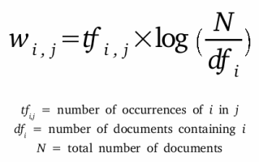
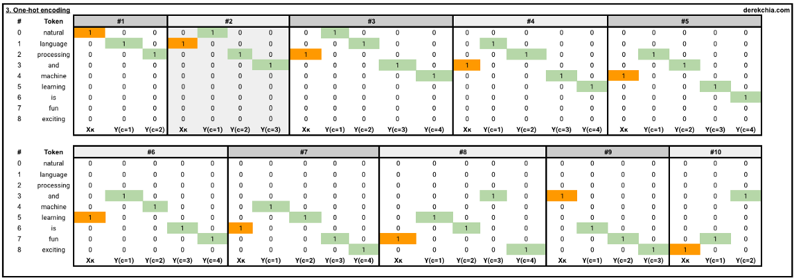

# Word Embeddings

## Idea

Word embeddings are real-valued **vectors**, with a *reduced* dimensionality such as 50, 100, or 300 dimensions.
The key idea behind those is that words with a similar meaning will be represented close to each other.
Therefore each word is mapped to one vector in a predefined **vector space**.
The distribution is learned based on the usage of words.

## Improvement

* Dimensionality reduction is comparison to sparse word representations like **one-hot encoding**
  * A few hundred vs. possibly thousands
  * Huge performance increase
* Natural capturing of the meaning of words
  * Words with similar usage result in similar representations

## Concept

There are different ways to compute word embeddings:

### Traditional Word Embeddings

1. **BoW** - Bag of Words
   * One-hot encoded matrix of words or n-grams
   * Common challenge: BoW does not include context information
2. **TF-IDF** - term frequency–inverse document frequency
   * Numerical statistic which reflects how important a word or n-gram is to a document
   * Value increases proportionally to mentions in the document
   *  - https://skymind.ai/wiki/bagofwords-tf-idf
3. **Distributional Embeddings**
   * Encapsulate context based on mutual information with other words in the document
   * Global co-references or based on restriced windows

### Neural Embeddings

1. Embedding Layer
   * Neural network jointly learned on one-hot encoded word vectors
   * Vector-size is specified as part of the model
2. Word2Vec
   * Predictive embedding model
   * **CBOW** - Continuous bag-of-words
     * Predicting current word based on context
     * Order of words does not influence prediction!
     * Several times faster to train than the skip-gram, slightly better accuracy for the frequent words
   * **SG** - Continuous Skip-gram
     * Predicting surrounding context by given word
     * Works well with small amount of the training data, represents well even rare words or phrases
   * "CBOW is faster while skip-gram is slower but does a better job for infrequent words."
   *  - [Beyond Word Embeddings](https://towardsdatascience.com/beyond-word-embeddings-part-2-word-vectors-nlp-modeling-from-bow-to-bert-4ebd4711d0ec)

    Implementation:
   * Sliding window to get context (neighbor) words
   * For each word, the context words are stored and used in training.
   * Error is calculated as sum over every error from context and selected words
   *  - [Word2Vec using Numpy](https://towardsdatascience.com/an-implementation-guide-to-word2vec-using-numpy-and-google-sheets-13445eebd281)

3. GloVe
   * Same intuition behind the co-occuring matrix used in distributional embeddings, but uses neural methods to decompose the co-occurrence matrix into more expressive and dense word vectors
4. FastText
   * Based on Word2Vec
   * Value of each representation in training are averaged into one vector
   * Encodes sub-word information

## Evaluation

When dealing with vectors, a common way to calculate a similarity score is [cosine similarity](https://en.wikipedia.org/wiki/Cosine_similarity).

## Production

## References

* [What are Word Embeddings for Text?](https://machinelearningmastery.com/what-are-word-embeddings/)
* [Beyond Word Embeddings](https://towardsdatascience.com/beyond-word-embeddings-part-2-word-vectors-nlp-modeling-from-bow-to-bert-4ebd4711d0ec)
* [The Illustrated Word2Vec](https://jalammar.github.io/illustrated-word2vec/)
* [GloVe](https://nlp.stanford.edu/projects/glove/)
* [Word2Vec using Numpy](https://towardsdatascience.com/an-implementation-guide-to-word2vec-using-numpy-and-google-sheets-13445eebd281)
