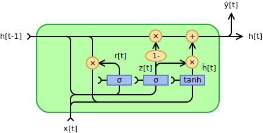

# GRU - Gated Recurrent Unit

## Idea

To solve the common problem of short-term memory in [RNNs](../rnn/rnn.md), GRUs provide mechanisms to store the desired information. GRUs are commonly used on top of a RNN architecture, with the difference in the activation blocks. By storing information in so called *cells* which are regulated by *gates*, GRUs provide the option to store relevant information over longer sequences. 

## Improvement

* Capability of storing long-term information
* Faster calculation than [LSTMs](../lstm/lstm.md)
* Quite easy implementation
* Sigmoid in gate is usefull for vanishing gradients
  <!-- * close to 0 -> $c^{<t>} = c^{<t-1>}$ -->
  * close to 0 -> 

## Concept

The GRU consisting of two gates and one memory cell.

*a*: activation

*c*: memory cell || hidden state *h*

<!-- $\tilde{c}$: candidate for replacing c || $\tilde{h}$ -->
: candidate for replacing *c* || 

<!-- $\Gamma_u$: update gate. Decides when to update (most of the time the value will be 0 or 1) || $u$ || $z$ -->
: update gate. Decides when to update (most of the time the value will be 0 or 1) || *u* || *z*

<!-- $\Gamma_r$: relevance gate. How relevant is $c^{<t-1>}$ to $\tilde{c}^{<t>}$ || $r$ -->
: relevance gate. How relevant is  to  || *r*

### Calculus

<!-- $c^{<t>} = a^{<t>}$ -->

<!-- $\tilde{c}^{<t>} = tanh(Wc[\Gamma_r * c^{<t-1>}, x^{<t>}] + bc)$ -->
)

<!-- $\Gamma_u = \sigma(Wu[c^{<t-1>}, x^{<t>}] + bu)$ -->
)

<!-- $\Gamma_r = \sigma(Wr[c^{<t-1>}, x^{<t>}] + br)$ -->
)

<!-- $c^{<t>} = \Gamma_u * \tilde{c}^{<t>} + (1 - \Gamma_u) * \tilde{c}^{<t-1>}$ -->
*\tilde{c}^{<t-1>})

### Architecture

 - [reference](https://en.wikipedia.org/wiki/Gated_recurrent_unit)

## Evaluation

## Production

## References

1. [GRU - Wikipedia](https://en.wikipedia.org/wiki/Gated_recurrent_unit)
2. [GRU Paper](https://arxiv.org/abs/1406.1078)
3. [Illustrated GRU](https://towardsdatascience.com/illustrated-guide-to-lstms-and-gru-s-a-step-by-step-explanation-44e9eb85bf21)
