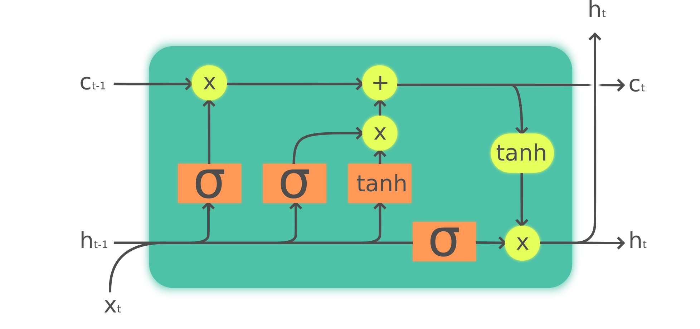

# LSTM - Long Short Term Memory

## Idea

To solve the common problem of short-term memory in [RNNs](../rnn/rnn.md), LSTMs provide mechanisms to store the desired information. LSTMs are commonly used on top of a RNN architecture, with the difference in the activation blocks. By storing information in so called *cells* which are regulated by *gates*, LSTMs provide the option to store relevant information over longer sequences. 

## Improvement

* Capability of storing long-term information
* Quite flexible in design
* More general and powerful than [GRUs](../gru/gru.md)
* Sigmoid in gate is usefull for vanishing gradients
  * close to 0 -> $c^{<t>} = c^{<t-1>}$

## Concept

The LSTM consisting of three gates and one memory cell.

$c$: memory cell 

$a$: activation || hidden state $h$

$\tilde{c}$: candidate for replacing c 

$\Gamma_u$: update gate. Decides when to update (most of the time the value will be 0 or 1) || $u$ || $i$

$\Gamma_f$: forget gate. Decides when to forget an value || $f$

$\Gamma_o$: output gate. || $o$

### Calculus

$\Gamma_u = \sigma(Wu[a^{<t-1>}, x^{<t>}] + bu)$

$\Gamma_f = \sigma(Wr[a^{<t-1>}, x^{<t>}] + bf)$

$\Gamma_o = \sigma(Wo[a^{<t-1>}, x^{<t>}] + bo)$

$\tilde{c}^{<t>} = tanh(Wc[a^{<t-1>}, x^{<t>}] + bc)$

$c^{<t>} = \Gamma_u * \tilde{c}^{<t>} + \Gamma_f * c^{<t-1>}$

* the memory cell has the option of keeping the old value and adding the new

$a^{<t>} = \Gamma_u * tanh(\tilde{c}^{<t>})$

### Architecture

 - [reference](https://en.wikipedia.org/wiki/Long_short-term_memory)

### Variation

**Peephole connection**: giving information from preceiding memory cells (using $c^{<t-1>}$ instead of $a^{<t-1>}$)

$\Gamma_u = \sigma(Wu[c^{<t-1>}, x^{<t>}] + bu)$

$\Gamma_f = \sigma(Wr[c^{<t-1>}, x^{<t>}] + bf)$

$\Gamma_o = \sigma(Wo[c^{<t-1>}, x^{<t>}] + bo)$

## Evaluation

## Production

## References

1. [LSTM - Wikipedia](https://en.wikipedia.org/wiki/Long_short-term_memory)
2. [LSTM Paper](https://www.researchgate.net/publication/13853244_Long_Short-term_Memory)
3. [LSTM Forget Gate Paper](https://ieeexplore.ieee.org/document/818041)
4. [Illustrated LSTM](https://towardsdatascience.com/illustrated-guide-to-lstms-and-gru-s-a-step-by-step-explanation-44e9eb85bf21)
